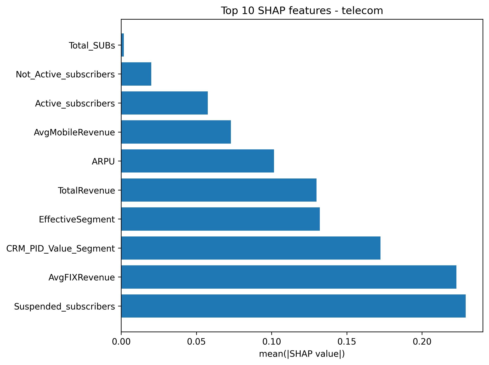
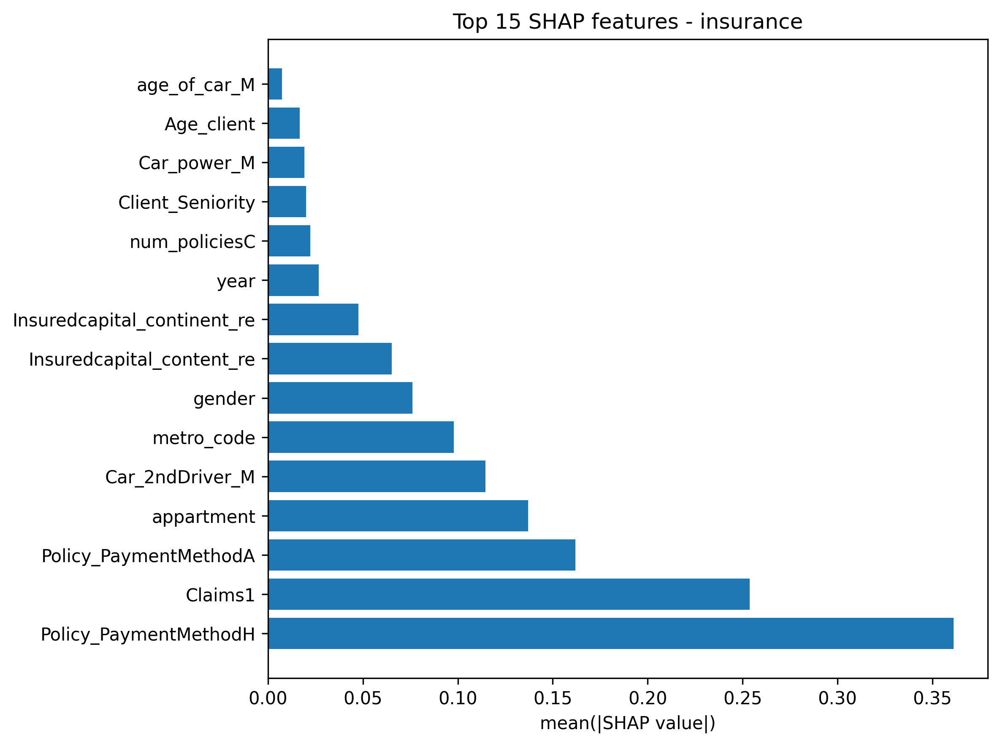

## 1. Project Overview
This research addresses the "Black Box" problem in predictive modeling. While high-performance algorithms like Gradient Boosting offer superior accuracy, their lack of transparency often hinders business adoption. This project develops an **Explainable AI (XAI)** framework to predict customer churn in two distinct sectors: **Telecommunications** and **Insurance**, providing both high predictive power and actionable insights.

Beyond just training models, this project culminates in a **Production-Ready Streamlit Application**. This interactive tool allows non-technical stakeholders to upload customer data and receive not just a "Churn/No Churn" prediction, but a transparent breakdown of the specific factors (usage, demographics, or billing) driving that individual customer's risk score.

[<i class="bi bi-github"></i> View Project on GitHub](https://github.com/anishR24/applied_research_project){target="_blank" .btn .btn-outline-dark .btn-sm} [<i class="bi bi-rocket-takeoff"></i> Launch Live App](https://anish-rao-churn-prediction.streamlit.app/){target="_blank" .btn .btn-outline-primary .btn-sm} 

[<i class="bi bi-database"></i> Telecom Dataset](https://doi.org/10.17632/nrb55gr66h.1){target="_blank" .btn .btn-outline-info .btn-sm}
[<i class="bi bi-database"></i> Insurance Dataset](https://doi.org/10.17632/vfchtm5y7j.1){target="_blank" .btn .btn-outline-info .btn-sm}

## 2. Research Methodology & Data Pipeline
The project followed a rigorous data science lifecycle to ensure the models were robust and generalized well to unseen data.

### Data Preprocessing & Engineering
* **Handling Imbalance:** Implemented **SMOTE** (Synthetic Minority Over-sampling Technique) to address the minority churn class.
* **Optimization:** Utilized **GridSearchCV** for hyperparameter tuning across all six algorithms.
* **Feature Selection:** Conducted Recursive Feature Elimination (RFE) to identify the most predictive variables for each industry.


---

## 3. Comprehensive Model Performance
I evaluated six diverse algorithms to find the optimal balance between bias and variance. The results below highlight the superiority of Gradient Boosting methods for tabular data.

### Model Performance Comparison

The following tables summarize the performance of all 6 algorithms across both datasets. Use the tabs to switch between the Telecom and Insurance results.

::: {.panel-tabset}

### Telecom Dataset
```{ojs}
//| echo: false
data_telecom = FileAttachment("metrics_grid_telecom.csv").csv({ typed: true })

Inputs.table(data_telecom, {
  rows: 10,
  sort: "f1_score",
  reverse: true,
  layout: "auto",
  columns: [
    "algorithm", "accuracy", "precision", "recall", "f1_score", "roc_auc"
  ],
  header: {
    algorithm: "Algorithm",
    accuracy: "Accuracy (%)",
    precision: "Precision (%)",
    recall: "Recall (%)",
    f1_score: "F1 Score (%)",
    roc_auc: "ROC AUC"
  },
  format: {
    accuracy: d => (d * 100).toFixed(2),
    precision: d => (d * 100).toFixed(2),
    recall: d => (d * 100).toFixed(2),
    f1_score: d => (d * 100).toFixed(2),
    roc_auc: d => d.toFixed(3)
  },
  width: {
    algorithm: 200
  }
})
```

###  Insurance Dataset
``` {ojs}
//| echo: false
data_insurance = FileAttachment("metrics_grid_insurance.csv").csv({ typed: true })

// 2. Display the table
Inputs.table(data_insurance, {
  rows: 10,
  sort: "f1_score",
  reverse: true,
  layout: "auto",
  columns: [
    "algorithm", "accuracy", "precision", "recall", "f1_score", "roc_auc"
  ],
  header: {
    algorithm: "Algorithm",
    accuracy: "Accuracy (%)",
    precision: "Precision (%)",
    recall: "Recall (%)",
    f1_score: "F1 Score (%)",
    roc_auc: "ROC AUC"
  },
  format: {
    accuracy: d => (d * 100).toFixed(2),
    precision: d => (d * 100).toFixed(2),
    recall: d => (d * 100).toFixed(2),
    f1_score: d => (d * 100).toFixed(2),
    roc_auc: d => d.toFixed(3)
  },
  width: {
    algorithm: 200
  }
})
```

:::

> **Analysis:** **CatBoost** consistently delivered the highest F1-Score and ROC-AUC across both industries. This is attributed to its sophisticated handling of categorical features and its ability to capture non-linear relationships without overfitting.


---

## 4. Explainable AI: SHAP Insights
A key finding of this research is that churn drivers are highly sector-dependent. Using **SHAP (SHapley Additive exPlanations)**, we can quantify the average impact of each feature on the model's output.

::: {layout-ncol=2}
{.border .shadow .rounded}

{.border .shadow .rounded}
:::

### Key Industry Findings:
* **Telecommunications:** Churn is dominated by **Operational Subscription Status**. `Suspended_subscribers` and `AvgFIXRevenue` are the most critical predictors, suggesting that service interruptions and billing fluctuations are the primary "Red Flags."
* **Insurance:** Churn is heavily tied to **Financial Logistics and Claims**. The `Policy_PaymentMethodH` and `Claims1` history are the strongest indicators, showing that how a customer pays and their recent claim experience dictate their loyalty more than demographic factors like age.

---

## 5. Web Application
To bridge the gap between academic research and business utility, the final models were deployed as a high-performance **Streamlit** web application. This tool serves as a sandbox for stakeholders to interact with the underlying machine learning logic.

::: {.column-page .border .shadow .rounded .p-3}
<iframe src="https://anish-rao-churn-prediction.streamlit.app/?embed=true" style="height: 850px; width: 100%; border: none;"></iframe>
:::

---

## 6. Business Impact & Recommendations
* **Precision-Targeting:** By using the model's risk scores, marketing teams can focus retention budgets on the top 10% of at-risk customers, potentially saving millions in lost revenue.
* **Proactive Engagement:** Insurance providers can trigger a "Loyalty Review" for customers who fit the demographic profile of high-risk churners identified by the model.

---

::: {.callout-tip}
## Research Assets & Code
View and Download the full 60-page dissertation and the complete project environment (including model weights and preprocessors) below.
:::

::: {layout-ncol=2}
[📄 View Full Dissertation (PDF)](20066423_Anish_Rao_Report.pdf){target="_blank" .btn .btn-outline-primary .rounded-pill .px-4}
[📥 Download Project Files (.zip)](churn_project_files.zip){target="_blank" .btn .btn-outline-primary .rounded-pill .px-4}
:::