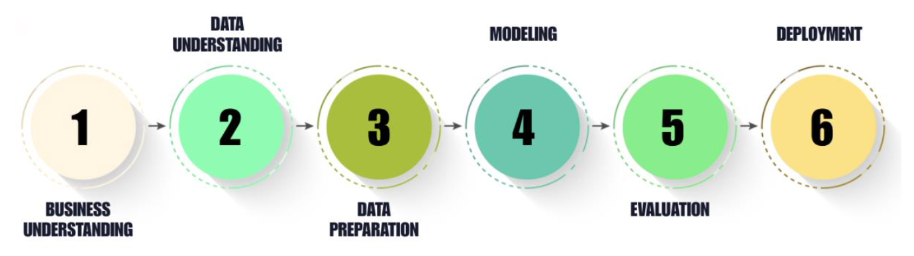
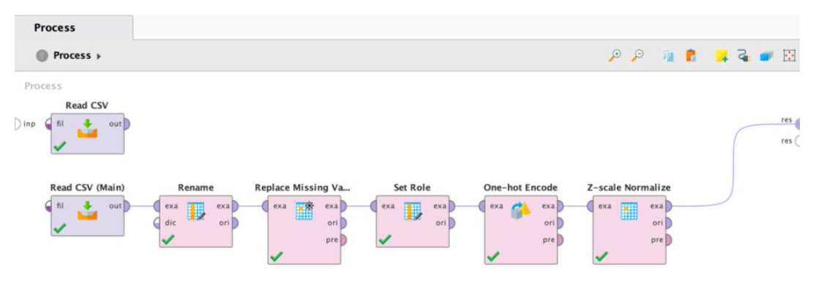

## Project Overview
This project applies the **CRISP-DM framework** to predict whether an individual's annual income exceeds \$50,000 using the Adult Census Income dataset.By comparing automated workflows in **RapidMiner** with manual implementations in **Python**, the study identifies the most effective deployment strategy for financial and marketing risk assessment

[<i class="bi bi-github"></i> View Project on GitHub](https://github.com/anishR24/advanced-data-and-network-mining/tree/main/CA2){target="_blank" .btn .btn-outline-dark .btn-sm}
[<i class="bi bi-database"></i> Dataset (UCI Repository)](https://doi.org/10.24432/C5XW20){target="_blank" .btn .btn-outline-info .btn-sm}

---

## Methodology: The CRISP-DM Process
The project followed the standard data mining lifecycle to ensure a structured approach:

1.  **Business Understanding:** Define the goal of predicting high-income individuals for targeted marketing.
2.  **Data Understanding:** Analyzed 48,842 records with 14 demographic features like age, education, and occupation.
3.  **Data Preparation:** Handled missing values (marked as '?'), implemented SMOTE to fix class imbalance, and applied feature scaling.
4.  **Modeling:** Developed parallel models including XGBoost, Random Forest, and Decision Trees.
5.  **Evaluation:** Measured performance using Accuracy, Precision, Recall, and F1-Score.

---

## RapidMiner AutoModel Performance
RapidMiner’s automated workflow focused on high-recall results, which is vital for identifying as many high-income candidates as possible.

The RapidMiner implementation utilized **AutoModel** to accelerate the data science lifecycle. 

* **Automated Preprocessing:** The system automatically handled missing value replacement and data transformation.

* **Feature Selection:** AutoModel performed automated correlation analysis to remove redundant or low-impact features.

* **Hyperparameter Tuning:** Utilized built-in optimization to find the best configurations for XGBoost and Random Forest, prioritizing **Recall** to ensure high-income individuals weren't missed.

| Model Name | Accuracy | Precision | Recall | F1-Score |
|---|---|---|---|---|
| **XGBoost** | **83.5%** | **84.8%** | **95.3%** | **89.8%** |
| Random Forest | 82.4% | 84.6% | 93.8% | 89.0% |
| Decision Tree | 82.5% | 83.7% | 95.5% | 89.2% |
| Logistic Regression | 83.1% | 84.7% | 94.7% | 89.4% |
| Naïve Bayes | 75.9% | 75.9% | 100.0% | 86.3% |

**Key Insight:** RapidMiner’s primary strength lies in its **Recall**. While the Naïve Bayes model achieved a perfect 100% recall, the **XGBoost model** provided the best overall balance for business deployment. Its remarkable **95.3% Recall** makes it the most effective tool for capturing the majority of high-income earners in the dataset without sacrificing too much precision.

---

## Python Implementation Comparison
The Python approach focused on granular control using the `scikit-learn` and `XGBoost` libraries.

* **Data Preparation:** Manual cleaning involved identifying and removing "dirty" data points (like '?' markers) and implementing specific scaling for linear models.

* **SMOTE Balancing:** Used the `imbalanced-learn` library to synthesize new examples of the minority class, moving from a 76/24 split to a **50:50 distribution**. This significantly improved the model's ability to learn "high income" patterns.

* **Encoding Strategy:** Implemented **Label Encoding** for categorical variables, which proved more computationally efficient and effective for tree-based models compared to standard One-Hot encoding.

| Model Name | Accuracy | Precision | Recall | F1-Score |
|---|---|---|---|---|
| **XGBoost** | **86.9%** | **72.9%** | **72.0%** | **72.5%** |
| Random Forest | 84.9% | 66.9% | 72.9% | 69.8% |
| Decision Tree | 83.5% | 64.0% | 71.0% | 67.3% |
| Logistic Regression | 81.0% | 57.0% | 83.2% | 67.7% |
| Naïve Bayes | 53.6% | 33.5% | 95.2% | 49.6% |

**Key Insight:** Python achieved the **highest raw accuracy (86.9%)** via XGBoost. The implementation of **SMOTE balancing** significantly improved the model's ability to learn "high income" patterns by creating a 50:50 class distribution. Furthermore, utilizing **Label Encoding** for categorical variables proved more efficient than One-Hot encoding for tree-based models. These manual engineering choices allowed the model to reach a higher accuracy ceiling, though it struggled to match the high recall/precision balance seen in the RapidMiner automation.

---

## Final Conclusion
The comparison between the two platforms led to these primary findings:

1. **Model Selection:** The **RapidMiner XGBoost** model is the preferred choice for deployment. While Python was more accurate overall, the RapidMiner version provided a superior **F1-Score (89.8%)** and high sensitivity (**95.3% Recall**), ensuring that high-income individuals were not missed by the model—a critical requirement for premium financial targeting.
2. **Platform Comparison:** Python provides deeper customization and manual control for experimental research, allowing for higher raw accuracy. In contrast, RapidMiner offers a more robust, efficient, and automated pipeline that significantly reduces the time required for preprocessing and model selection, making it better suited for production-ready business logic.
3. **Data Impact:** Balancing the dataset was the single most important factor in the project's success. Whether through manual **SMOTE balancing** in Python or automated tuning in RapidMiner, addressing the class imbalance was essential for moving from simple classification to a reliable predictive tool.

---

## Complete Analysis Notebook
To view the full Python implementation, complete methodology, and execution logs, please visit the technical notebook page.

::: {.d-grid .gap-2}
[<i class="bi bi-code-square"></i> View Technical Implementation - Python Notebook](mining_code.ipynb){.btn .btn-outline-primary .btn-lg role="button"}
:::

::: {.callout-tip}
## Project Documentation
The complete methodology, including the comparative analysis of RapidMiner’s AutoModel and Python implementations, performance results, and deployment insights, is available in the full technical report.

The RapidMiner .rmp file can be imported directly into RapidMiner Studio to replicate the automated pipeline and results.
:::

::: {.d-grid .gap-2 .col-6 .mx-auto}
[<i class="bi bi-file-earmark-pdf"></i> View Final Report](mining.pdf){target="_blank" .btn .btn-outline-primary .rounded-pill .px-4}
[<i class="bi bi-file-earmark-code"></i> RapidMiner Process (.rmp)](CRISP-DM_RapidMinerProcess.rmp){download="CRISP-DM_RapidMinerProcess.rmp" .btn .btn-outline-primary .rounded-pill .px-4}
[<i class="bi bi-file-earmark-code-fill"></i> Python Notebook (.ipynb)](mining_code.ipynb){download="mining_code.ipynb" .btn .btn-outline-primary .rounded-pill .px-4}

:::