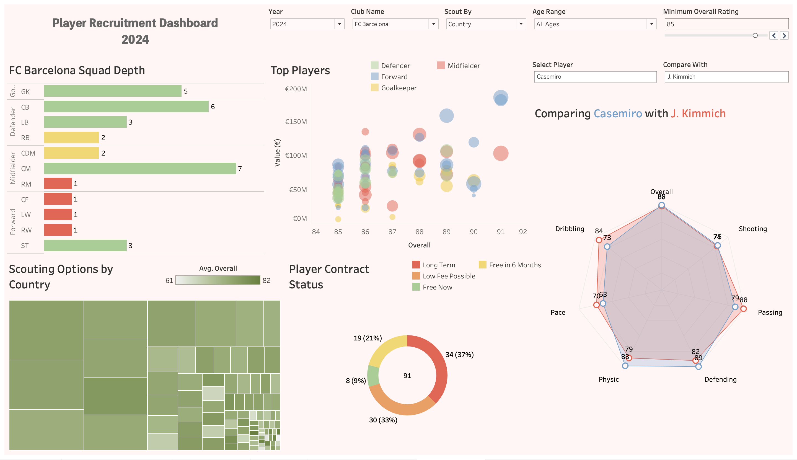
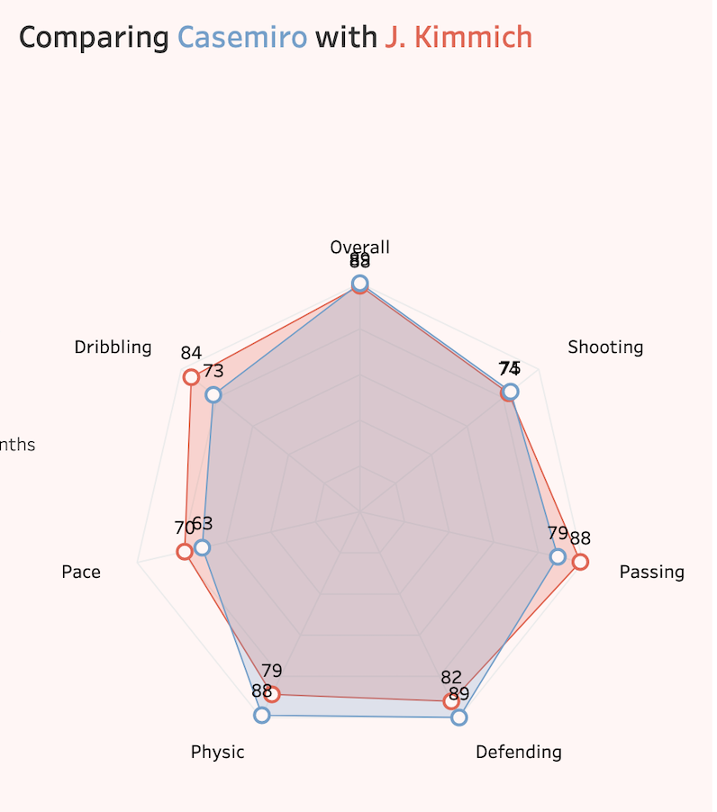
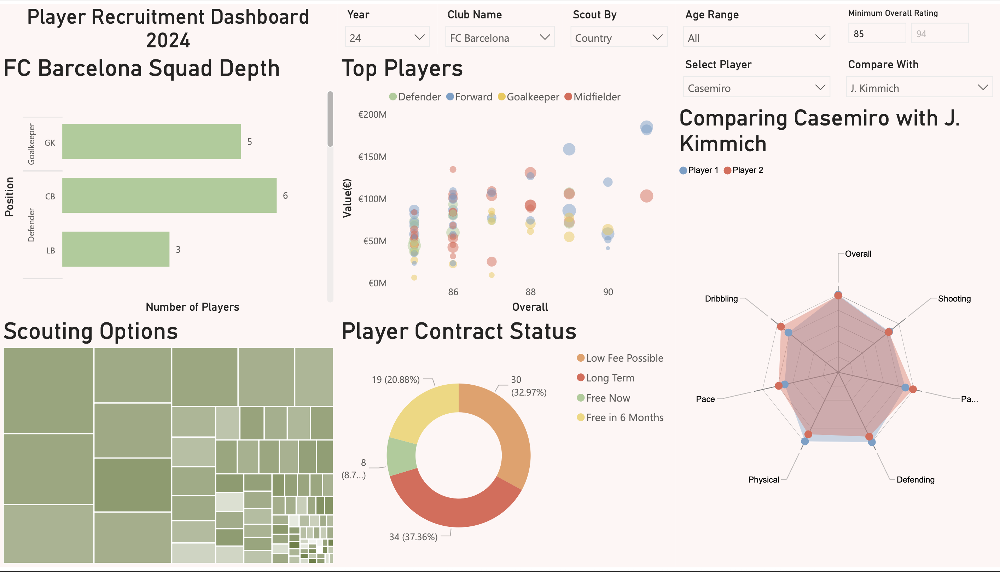

[<i class="bi bi-arrow-left"></i> Back to Visualisation Overview](../viz_index.qmd){.btn .btn-outline-secondary .btn-sm role="button"}

---

## Project Overview
This project involved acting as a Data Consultant for a Director of Recruitment, building identical scouting dashboards in both **Tableau** and **Power BI**. The goal was to conduct a "head-to-head" comparison of how each tool handles complex data modeling, custom extensions, and user interactivity in a high-stakes sports analytics context.

[<i class="bi bi-github"></i> View Project on GitHub](https://github.com/anishR24/data-visualisation/tree/main/CA2){target="_blank" .btn .btn-outline-dark .btn-sm} [<i class="bi bi-database"></i> Dataset (Kaggle - male_players.csv)](https://www.kaggle.com/datasets/stefanoleone992/ea-sports-fc-24-complete-player-dataset?select=male_players.csv){target="_blank" .btn .btn-outline-info .btn-sm}

## The Dashboards

### Tableau Implementation
Tableau was utilized for its superior customization and "pixel-perfect" design capabilities. Key features include dynamic multi-colored titles that act as pseudo-legends and precise manual sorting for squad depth analysis.

[<i class="bi bi-bar-chart-line"></i> View on Tableau Public](https://public.tableau.com/app/profile/anish.rao/viz/Final_Draft_CA1/FinalDashboard){target="_blank" .btn .btn-outline-primary .btn-sm}

### Dashboard Preview
{.border .shadow .rounded}

::: {.column-page}

  <noscript>
    
  </noscript>
  <object class='tableauViz' style='display:none;'>
    <param name='host_url' value='https%3A%2F%2Fpublic.tableau.com%2F' /> 
    <param name='embed_code_version' value='3' /> 
    <param name='site_root' value='' />
    <param name='name' value='Final_Draft_CA1&#47;FinalDashboard' />
    <param name='tabs' value='no' />
    <param name='toolbar' value='yes' />
    <param name='static_image' value='https:&#47;&#47;public.tableau.com&#47;static&#47;images&#47;Fi&#47;Final_Draft_CA1&#47;FinalDashboard&#47;1.png' /> 
    <param name='animate_transition' value='yes' />
    <param name='display_static_image' value='yes' />
    <param name='display_spinner' value='yes' />
    <param name='display_overlay' value='yes' />
    <param name='display_count' value='yes' />
    <param name='language' value='en-US' />
  </object>

                

:::

&nbsp;
&nbsp;

**Feature Spotlight: Player Profiling Radar Charts**
Because Tableau Public does not support third-party extensions, I have provided a screenshot of the specialized **Radar Chart** profiling tool below. This allows for direct athletic comparison between players like Casemiro and Joshua Kimmich.

::: {layout-ncol=1 style="margin: auto; width: 50%;"}
{.border .shadow .rounded}
:::

### Power BI Implementation
Power BI excelled in data transformation and structured modeling. Using Power Query, I efficiently handled complex player position delimiters and utilized native custom visuals for the player profiling radar charts.

*Note: Due to organizational security settings, the live preview below may require a login. If the preview does not load, please use the download option in the resources section below to view the file in Power BI Desktop.*

{.border .shadow}

[<i class="bi bi-lightning-charge"></i> View Power BI Report](https://app.powerbi.com/reportEmbed?reportId=6c45ced1-6473-4af4-b49a-9a8b1ef412ab&autoAuth=true&ctid=5d0aa6ea-6620-4863-9e21-9ecb140222bc){target="_blank" .btn .btn-outline-info .btn-sm}

::: {.column-page}
::: {.callout-important collapse="true"}
## Click to expand Live Interactive Dashboard
*Note: Due to organizational security settings, the live preview below may require a login. If it does not load, please use the download button at the bottom of the page.*

<iframe title="Football Recruitment" width="100%" height="600px" src="https://app.powerbi.com/reportEmbed?reportId=6c45ced1-6473-4af4-b49a-9a8b1ef412ab&autoAuth=true&ctid=5d0aa6ea-6620-4863-9e21-9ecb140222bc" frameborder="0" allowFullScreen="true"></iframe>
:::
:::

## Technical Implementation & Evaluation

During development, several key differences between the platforms were identified:

* **Data Transformation:** Power BI's **Power Query** (M Language) provided more robust data cleaning options, while Tableau's **in-context calculations** (SPLIT functions) were faster for quick field creation.
* **Visual Flexibility:** Tableau allowed for more precise label positioning and custom "workarounds" for complex chart types.
* **Radar Chart Challenge:** Implementing a Radar Chart for player profiling required an external extension in Tableau but was supported via native custom visuals in Power BI.

::: {.callout-tip}
## Comparative Analysis & Project Files
This project involved a detailed head-to-head evaluation of BI tools. You can view and download the full technical report and the raw source files for both platforms below to inspect the data models and DAX measures.
:::

[📄 View Comparative Report (PDF)](football_scouting.pdf){target="_blank" .btn .btn-outline-primary .rounded-pill .px-4}
[📥 Download Tableau (.twbx)](football_scouting.twbx){target="_blank" .btn .btn-outline-primary .rounded-pill .px-4}
[📥 Download Power BI (.pbix)](football_scouting.pbix){target="_blank" .btn .btn-outline-primary .rounded-pill .px-4}