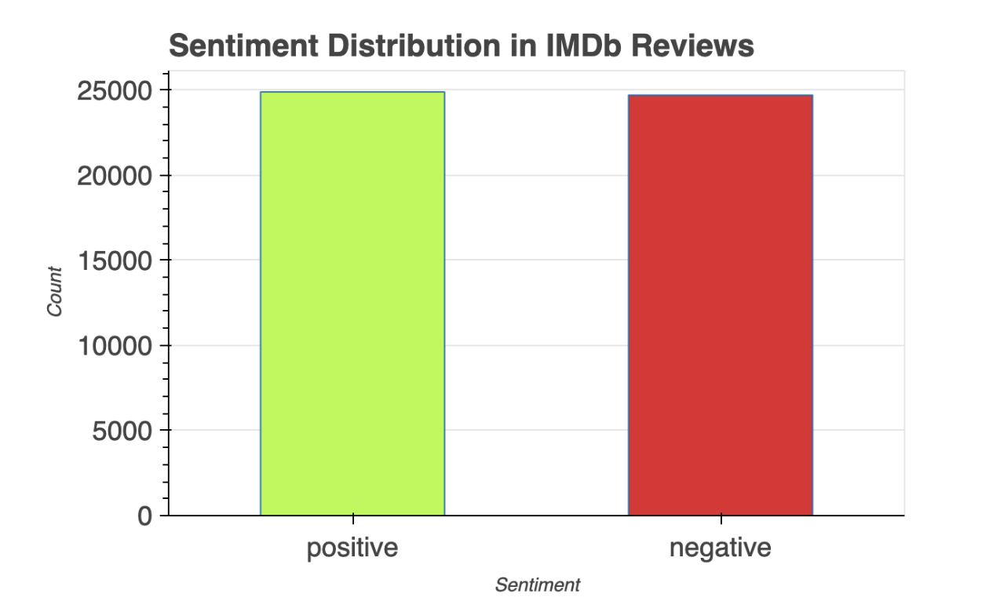
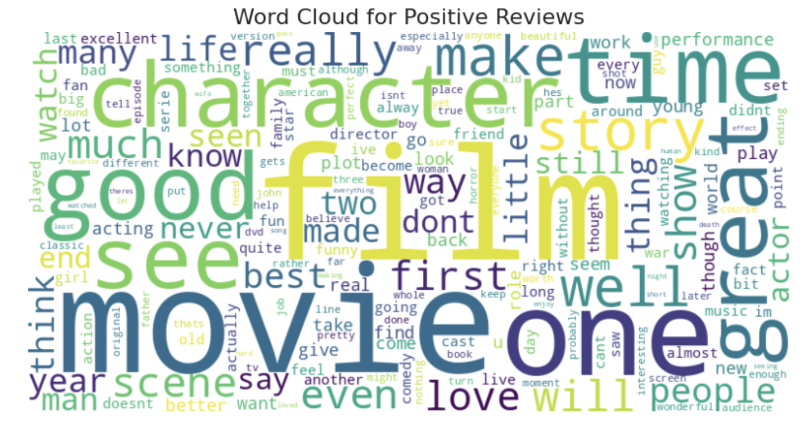
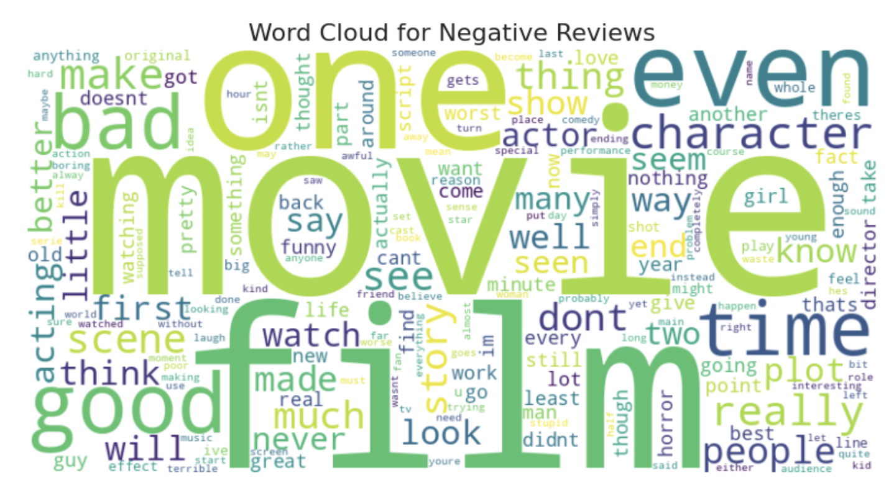
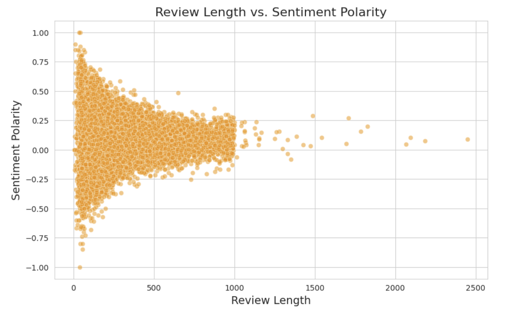
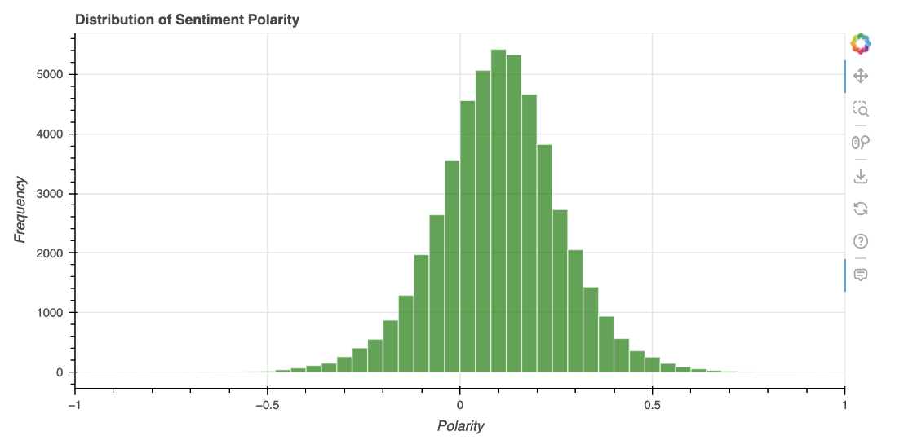
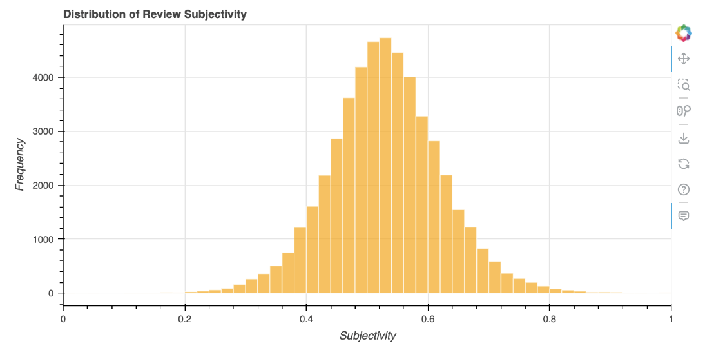

## Project Overview
This project explores a dataset of **50,000 IMDb movie reviews**, focusing on how user sentiment correlates with review length and linguistic style. By utilizing `TextBlob` for polarity and subjectivity, the analysis identifies the threshold where a review shifts from "emotional outburst" to "analytical critique."

[<i class="bi bi-github"></i> View Project on GitHub](https://github.com/anishR24/programming-for-data-analysis/tree/main/CA2){target="_blank" .btn .btn-outline-dark .btn-sm} 
[<i class="bi bi-google"></i> Open in Colab](https://colab.research.google.com/drive/1T5Y68YAz2MWrdia0iPZ70jzqFE7d2E9S?usp=sharing){target="_blank" .btn .btn-outline-primary .btn-sm} 
[<i class="bi bi-database"></i> Dataset (Kaggle)](https://www.kaggle.com/datasets/lakshmi25npathi/imdb-dataset-of-50k-movie-reviews){target="_blank" .btn .btn-outline-info .btn-sm}

---

## The NLP Pipeline
The project follows a structured NLP pipeline to transform unstructured text into quantifiable metrics:

1. **Data Acquisition:** Utilization of the IMDb 50k dataset (Maas et al., 2011).
2. **Text Preprocessing:**
    - **Cleaning:** Removal of HTML tags, punctuation, and special characters.
    - **Normalization:** Lowercasing text for consistency.
    - **Tokenization & Filtering:** Segmenting text and removing "stopwords" (common fillers) to focus on high-impact keywords.
3. **Exploratory Data Analysis (EDA):** Statistical analysis of review lengths and word frequency distributions.
4. **Sentiment Modeling:** Implementing the `TextBlob` library to calculate Polarity and Subjectivity.
5. **Correlation Analysis:** Cross-referencing review length against polarity scores.

---

## 1. Sentiment Distribution
**Insight:** The dataset exhibits a balanced sentiment distribution with 25,000 positive and 25,000 negative reviews. This parity ensured that the analysis of word frequencies and emotional weights remained unbiased across both sentiment classes.

---

## 2. Visualizing the Lexicon (Word Clouds)
**Insight:** Frequency analysis through Word Clouds revealed distinct linguistic patterns. 

::: {layout-ncol=2}

:::

::: {layout-ncol=2}
**Positive reviews** include the words **"film," "movie," "great," "story,"** and **"time,"** suggesting that reviewers focus on the quality of the story and overall enjoyment.

**Negative reviews** also highlight **"film"** and **"movie,"** but words like **"bad," "even,"** and **"really,"** indicating stronger dissatisfaction are also used a lot.

:::

*The common words suggests that although both sentiments discuss similar aspects, their tone and context significantly differ.*

---

## 3. The Brevity Paradox: Review Length vs. Sentiment Polarity
**Insight:** This analysis explores the "Inverse Correlation" between how much a user writes and the emotional extremity of their review.

* **The Correlation:** A weak negative correlation (**-0.049**) indicates that as review length increases, sentiment polarity slightly decreases. In short, longer reviews contain less extreme opinions.
* **Short Reviews (<200 words):** These frequently exhibit very high or very low polarity, demonstrating stronger, more impulsive emotions.
* **Long Reviews (>500 words):** These tend to cluster around a neutral sentiment. This suggests that users who write more are providing a **detailed analysis** rather than emotional extremes.
* **Key Discovery:** Users who write brief reviews tend to express stronger emotions, while longer reviews are more balanced and focused on the movie's details.

---

## 4. Sentiment Polarity & Subjectivity Distributions
**Insight:** These histograms visualize the frequency of emotional scales and the "fact vs. opinion" nature of the 50,000 reviews.

::: {layout-ncol=2}

:::

::: {layout-ncol=2}
### Polarity Distribution (Emotional Scale)
* **General Bias:** **74.7%** of reviews are moderately positive (0 to 0.5), showing a general community bias toward positive sentiment.
* **Negative Sentiment:** Moderately negative reviews (-0.5 to 0) make up **24.1%**, indicating that while negative reviews exist, they are less extreme.
* **The Extremes:** Highly polarized reviews are rare; the dataset contains only 57 highly negative reviews compared to 471 highly positive ones.

### Subjectivity Distribution (Fact vs. Opinion)
* **The "Opinionated" Middle:** **59.8%** of reviews are moderately subjective (0.5 to 0.7). This suggests users provide a mix of opinion and fact without being overly exaggerated.
* **The Rarity of Objectivity:** Only **0.88%** of reviews are extremely objective. Purely factual reviews are exceptionally rare on IMDb.
* **Final Insight:** Reviews tend to be opinionated but not overly extreme, with extremely subjective reviews (3.6%) also being uncommon.
:::

---

## 5. Final Conclusions
Based on the experimental results in the report and notebook:

1. **Sentiment Trends:** While the dataset is balanced, moderately positive reviews are the most common across the 50,000 samples.
2. **Emotional Intensity:** There is a clear inverse relationship between length and extremity; short reviews are brief and to the point with high emotional volatility.
3. **Platform Behavior:** The high subjectivity scores across the board establish IMDb as a platform driven by personal fan expression rather than objective, fact-based film theory.

---

## Complete Analysis Notebook
To view the full Python implementation, complete methodology, and execution logs, please visit the technical notebook page.

::: {.d-grid .gap-2}
[<i class="bi bi-code-square"></i> View Technical Implementation - Python Notebook](sentiment_code.ipynb){.btn .btn-outline-primary .btn-lg role="button"}
:::

::: {.callout-tip}
## Project Documentation
The complete methodology, data analysis, and insights are detailed in the full technical report.
:::

::: {.d-grid .gap-2 .col-6 .mx-auto}
[<i class="bi bi-file-earmark-pdf"></i> View Final Report](sentiment.pdf){target="_blank" .btn .btn-outline-primary .rounded-pill .px-4}
:::