## Project Overview
This project demonstrates the full Business Intelligence lifecycle, transforming **2.8 million raw taxi records** into an optimized Data Warehouse. The goal was to provide a "Director of Recruitment" with actionable insights into driver performance and geographic demand using a robust SQL Server foundation.

[<i class="bi bi-github"></i> View Project on GitHub](https://github.com/anishR24/data-storage-solutions-for-data-analytics/tree/main/CA1){target="_blank" .btn .btn-outline-dark .btn-sm} [<i class="bi bi-database"></i> Dataset (NYC Yellow Taxi - Jan 2024)](https://www.nyc.gov/site/tlc/about/tlc-trip-record-data.page#:~:text=January-,Yellow%20Taxi%20Trip%20Records,-(PARQUET)){target="_blank" .btn .btn-outline-info .btn-sm}

## Project Roadmap
::: {style="display: flex; flex-direction: column; gap: 10px; max-width: 400px;"}
[**Phase 1:** Modeling](#phase-1-dimensional-modeling-ssms){.btn .btn-outline-primary .btn-sm .m-1}
[**Phase 2:** ETL Pipeline](#phase-2-automated-etl-pipeline-ssis){.btn .btn-outline-primary .btn-sm .m-1}
[**Phase 3:** SSRS Reports](#phase-3-operational-reporting-ssrs){.btn .btn-outline-primary .btn-sm .m-1}
[**Phase 4:** Tableau Dashboard](#phase-4-visual-analytics-tableau){.btn .btn-outline-primary .btn-sm .m-1}
:::

## Phase 1: Dimensional Modeling (SSMS)
The core of this solution is a **Star Schema** implemented within a custom `taxi` schema in SQL Server. By moving away from a flat-file structure, we optimized the database for analytical speed and enforced strict referential integrity.

### The Architectural Blueprint
I designed a central **Fact Table** (`FactTaxiTrip`) connected to four specialized **Dimensions**. This structure allows stakeholders to filter millions of rows by Vendor, Location, Payment Type, or Date in milliseconds.

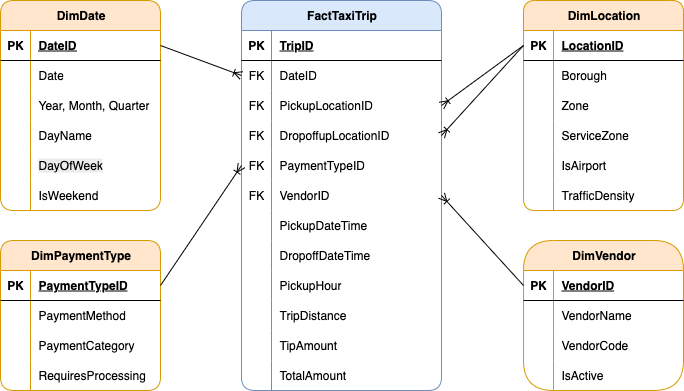{.border .shadow .rounded}

### SQL Implementation: Schema & Tables
Below is the core DDL (Data Definition Language) used to establish the warehouse structure. 

```javascript
// 1. Database and Schema Setup
CREATE DATABASE NYC_Taxi_DW;
GO
USE NYC_Taxi_DW;
GO
CREATE SCHEMA taxi;
GO

// 2. Creating the Dimension for Service Locations
CREATE TABLE taxi.FactTaxiTrip (
    TripID BIGINT IDENTITY(1,1) PRIMARY KEY,
    DateID INT NOT NULL,
    VendorID INT NOT NULL,
    PickupLocationID INT NOT NULL,
    DropoffLocationID INT NOT NULL,
    PaymentTypeID INT NOT NULL,

    PickupDateTime DATETIME2 NOT NULL,
    DropoffDateTime DATETIME2 NOT NULL,
    PickupHour AS (DATEPART(HOUR, PickupDateTime)) PERSISTED,

    TripDistance DECIMAL(8,2),
    TipAmount DECIMAL(10,2),
    TotalAmount DECIMAL(10,2),

    CONSTRAINT FK_Fact_Date FOREIGN KEY (DateID) REFERENCES taxi.DimDate(DateID),
    CONSTRAINT FK_Fact_Vendor FOREIGN KEY (VendorID) REFERENCES taxi.DimVendor(VendorID),
    CONSTRAINT FK_Fact_PickupLocation FOREIGN KEY (PickupLocationID) REFERENCES taxi.DimLocation(LocationID),
    CONSTRAINT FK_Fact_DropoffLocation FOREIGN KEY (DropoffLocationID) REFERENCES taxi.DimLocation(LocationID),
    CONSTRAINT FK_Fact_Payment FOREIGN KEY (PaymentTypeID) REFERENCES taxi.DimPaymentType(PaymentTypeID)
);
```

::: {.callout-note collapse="true"}
## View Dimension Table Setup (DDL)
These scripts establish the lookup tables for Dates, Vendors, Locations, and Payment Types.

```javascript
CREATE TABLE taxi.DimDate (
    DateID INT PRIMARY KEY,
    Date DATE NOT NULL,
    Year INT NOT NULL,
    Month INT NOT NULL,
    DayOfWeek INT NOT NULL,
    DayName VARCHAR(10) NOT NULL,
    Quarter INT NOT NULL,
    IsWeekend BIT NOT NULL
);

CREATE TABLE taxi.DimVendor (
    VendorID INT PRIMARY KEY,
    VendorName VARCHAR(100) NOT NULL,
    VendorCode VARCHAR(10) NOT NULL,
    IsActive BIT NOT NULL DEFAULT 1
);

CREATE TABLE taxi.DimLocation (
    LocationID INT PRIMARY KEY,
    Zone VARCHAR(100) NOT NULL,
    Borough VARCHAR(50) NOT NULL,
    ServiceZone VARCHAR(50) NOT NULL,
    IsAirport BIT NOT NULL DEFAULT 0,
    TrafficDensity VARCHAR(20) NOT NULL DEFAULT 'Medium'
);

CREATE TABLE taxi.DimPaymentType (
    PaymentTypeID INT PRIMARY KEY,
    PaymentMethod VARCHAR(50) NOT NULL,
    PaymentCategory VARCHAR(30) NOT NULL,
    RequiresProcessing BIT NOT NULL DEFAULT 0
);
```
:::

### Performance Optimization: Indexing Strategy
To handle the scale of 2.8 million records, I implemented a non-clustered indexing strategy. This specifically targets the "hot" columns used in our SSRS and Tableau reports, such as DateID and PickupHour.

```javascript
CREATE NONCLUSTERED INDEX IX_Fact_DateID 
ON taxi.FactTaxiTrip(DateID) 
INCLUDE (TotalAmount, TripDistance);

CREATE NONCLUSTERED INDEX IX_Fact_VendorID 
ON taxi.FactTaxiTrip(VendorID, DateID) 
INCLUDE (TotalAmount);

CREATE NONCLUSTERED INDEX IX_Fact_PickupHour 
ON taxi.FactTaxiTrip(PickupHour) 
INCLUDE (TotalAmount, TripDistance);

CREATE NONCLUSTERED INDEX IX_Fact_Locations 
ON taxi.FactTaxiTrip(PickupLocationID, DropoffLocationID) 
INCLUDE (TotalAmount, TripDistance);
```

::: {.callout-tip}
## Phase 1 Downloads
The technical architecture and full SQL scripts are available below.
:::
::: {layout-ncol=1}
[📥 Download SQL Scripts (.sql)](nyc_taxi_dw.sql){target="_blank" .btn .btn-outline-primary .rounded-pill .px-4}
:::

## Phase 2: Automated ETL Pipeline (SSIS)

With the Data Warehouse structure ready, I developed an automated **Extraction, Transformation, and Loading (ETL)** process using SQL Server Integration Services (SSIS). This pipeline ensures that raw, messy taxi data is cleaned and standardized before hitting the production tables. The process involves extracting data from flat files, performing lookups to match dimension keys, and handling data quality issues in real-time.

### 1. Control Flow Overview
The Control Flow serves as the orchestrator of the entire process. It handles environment cleanup (truncating old data) and ensures that Dimensions are fully populated before the Fact table begins its load to maintain referential integrity.

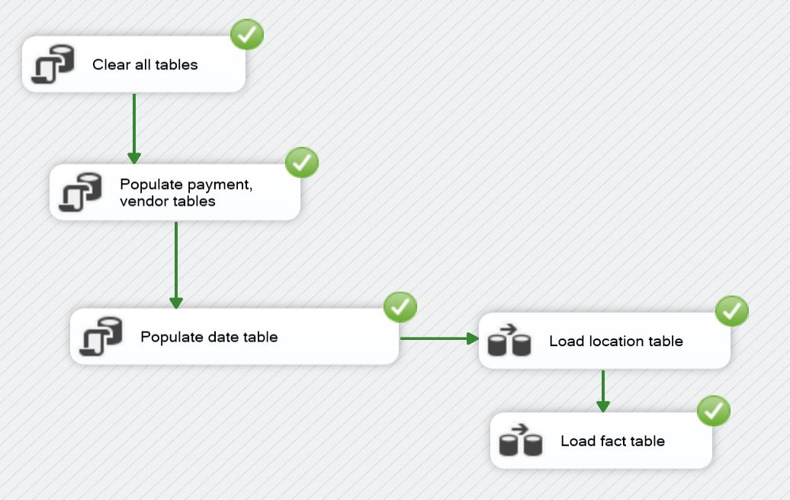{.border .shadow .rounded}

::: {.callout-note collapse="true"}
## View Execute SQL Tasks (Cleanup & Seed Data)
These scripts run at the start of the pipeline to truncate staging tables and populate static dimension members (Date, Vendor, Payment Type) via Execute SQL Tasks.

```javascript
// Clear All Tables (Cleanup for running multiple times)
TRUNCATE TABLE taxi.FactTaxiTrip;
DELETE FROM taxi.DimLocation WHERE LocationID != 999;
DELETE FROM taxi.DimPaymentType;
DELETE FROM taxi.DimVendor;
DELETE FROM taxi.DimDate;
```

```javascript
// Populate Payment & Vendor Tables (Values from NYC Taxi website data guide)
INSERT INTO taxi.DimPaymentType (PaymentTypeID, PaymentMethod, PaymentCategory, RequiresProcessing) VALUES
(0, 'Flex Fare trip', 'Variable', 1),
(1, 'Credit card', 'Electronic', 1),
(2, 'Cash', 'Physical', 0),
(3, 'No charge', 'Comp', 0),
(4, 'Dispute', 'Issue', 1),
(5, 'Unknown', 'Other', 0),
(6, 'Voided trip', 'Cancelled', 0),
(99, 'Missing/Error', 'Error', 0);

INSERT INTO taxi.DimVendor (VendorID, VendorName, VendorCode, IsActive) VALUES
(1, 'Creative Mobile Technologies, LLC', 'CMT', 1),
(2, 'Curb Mobility, LLC', 'CURB', 1), 
(6, 'Myle Technologies Inc', 'MYLE', 1),
(7, 'Helix', 'HELIX', 1),
(99, 'Unknown/Missing', 'UNK', 0);
```

```javascript
// Populate Date Table (Dates from 1-31 Jan and 31Dec, 2Feb)
DECLARE @StartDate DATE = '2024-01-01';
DECLARE @EndDate DATE = '2024-01-31';

WHILE @StartDate <= @EndDate
BEGIN
    INSERT INTO taxi.DimDate VALUES (
        CAST(CONVERT(VARCHAR(8), @StartDate, 112) AS INT),
        @StartDate,
        YEAR(@StartDate),
        MONTH(@StartDate),
        DATEPART(WEEKDAY, @StartDate),
        DATENAME(WEEKDAY, @StartDate),
        DATEPART(QUARTER, @StartDate),
        CASE WHEN DATENAME(WEEKDAY, @StartDate) IN ('Saturday', 'Sunday') THEN 1 ELSE 0 END
    );
    SET @StartDate = DATEADD(DAY, 1, @StartDate);
END

INSERT INTO taxi.DimDate (DateID, Date, Year, Month, DayOfWeek, DayName, Quarter, IsWeekend)
VALUES (20231231, '2023-12-31', 2023, 12,1, 'Sunday', 4, 1),
VALUES (20240201, '2024-02-01', 2024, 2, 5, 'Thursday', 1, 0);
```
:::

### 2. Data Flow: Location Dimension
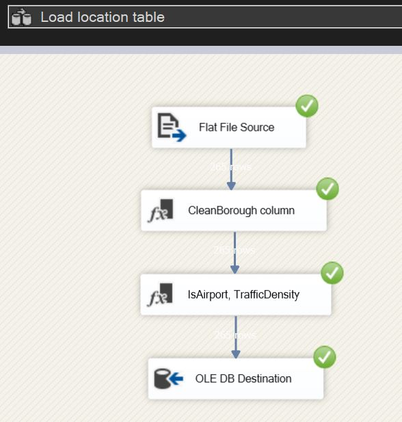{.border .shadow .rounded}

**Transformation Logic:**

* **Derived Column (CleanBorough):** Used to remove unwanted characters from raw strings.
* **Derived Column (Feature Engineering):** Created logic to flag airport zones and categorize traffic density based on borough location.

```javascript
// DerivedColumn1 (remove quotes for parsing) -
CleanBorough => REPLACE(["Borough"],"\"","")

// DerivedColumn2 -
IsAirport => FINDSTRING(["Zone"],"Airport",1) > 0 ? (DT_BOOL)1 : (DT_BOOL)0
TrafficDensity => (DT_STR,20,1252)(CleanBorough == "Manhattan" ? "High" : (CleanBorough == "Brooklyn" || CleanBorough == "Queens" || CleanBorough == "Bronx" ? "Medium" : "Low"))
```

### 3. Data Flow: Fact Table
The Fact table's Data Flow is the most complex, involving multiple transformations to ensure data quality and consistency.
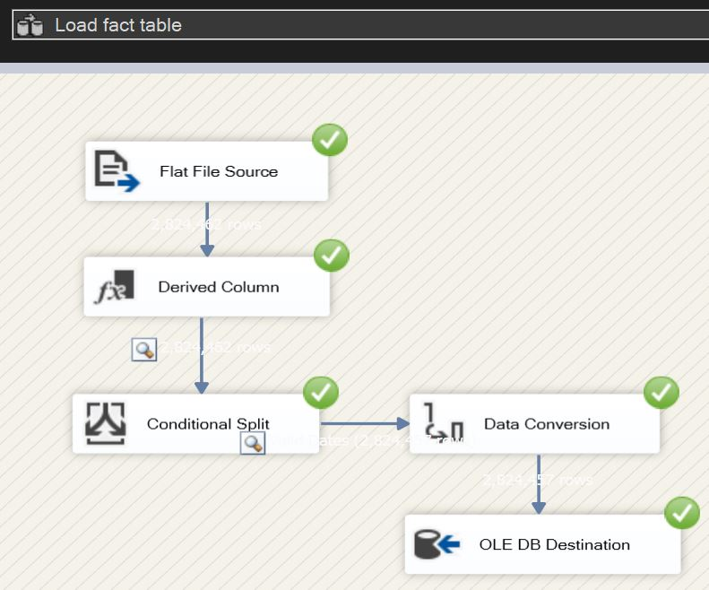{.border .shadow .rounded}

**Transformation Logic:**

* **Derived Column:** Standardizes \N null strings into "Unknown" keys (99/999) and converts date strings into DateID integers.
* **Conditional Split:** Filters the dataset to only include the specific scouting window requested.
* **Data Conversion**: Explicitly casts types to match the SQL Warehouse schema.

```javascript
DateID (new column) => (DT_I4)REPLACE(SUBSTRING(["tpep_pickup_datetime"],1,10),"-","")
PickupDateTime (new column) => (DT_DBTIMESTAMP2,0)["tpep_pickup_datetime"]
DropOffDateTime (new column) => (DT_DBTIMESTAMP2,0)["tpep_dropoff_datetime"]
CleanVendorID(new column) => ["VendorID"] == "\N" ? "99" : ["VendorID"]
CleanPaymentType (new column) => ["payment_type"] == "\N" ? "99" : ["payment_type"]
CleanLocationPickup (new column) => ["PULocationID"] == "\N" ? "999" : ["PULocationID"]
CleanLocationDropoff (new column) => ["DOLocationID"] == "\N" ? "999" : ["DOLocationID"]
CleanTripDistance (new column) => ["trip_distance"] == "\N" ? "0" : ["trip_distance"]
CleanTipAmount (new column) => ["tip_amount"] == "\N" ? "0" : ["tip_amount"]
CleanTotalAmount (new column) => ["total_amount"] == "\N" ? "0" : ["total_amount"]

// ConditionalSplit (include only values in range)-
DateID >= 20231231 && DateID <= 20240201

// DataConversion -
CleanVendorID, CleanPaymentType, CleanLocationPickup, CleanLocationDropoff => four-byte signed integer [DT_I4]
CleanTripDistance, CleanTipAmount, CleanTotalAmount => numeric [DT_NUMERIC]
```
---

::: {.callout-tip}
## Phase 2 Technical Assets
The complete ETL logic, including the SSIS packages and supporting SQL initialization scripts, is available in the unified project archive below.
:::

::: {layout-ncol=1}
[📥 Download SSIS Project Archive (.zip)](nyc_taxi_ssis.zip){target="_blank" .btn .btn-outline-primary .rounded-pill .px-4}
:::

---

## Phase 3: Operational Reporting (SSRS)

With the Data Warehouse populated, I developed a comprehensive suite of operational reports using **SQL Server Reporting Services (SSRS)**. This layer transforms complex data into interactive tools for the "Director of Recruitment," focusing on usability and data accessibility across 2.8 million records.

### 1. Interactive Drill-Down Reports
I designed a 3-level hierarchical reporting system. This allows stakeholders to start with a high-level executive summary and navigate deep into specific performance metrics without leaving the report interface.

::: {layout-ncol=3}
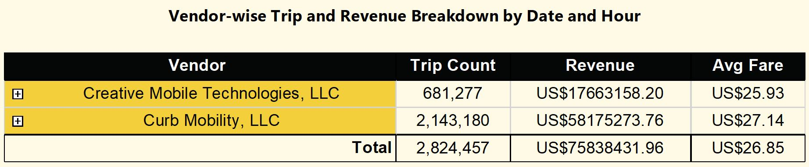{.border .shadow}

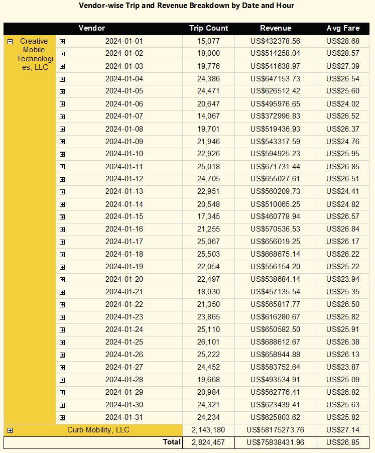{.border .shadow}

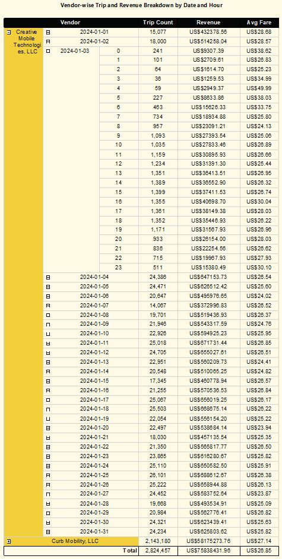{.border .shadow}
:::

### 2. Parameterized Filtering
To make the reports truly dynamic, I implemented advanced **Parameters**. Users can filter the entire dataset by Vendor, Date, or Location, ensuring they only see the data relevant to their specific query.

::: {layout-ncol=3}
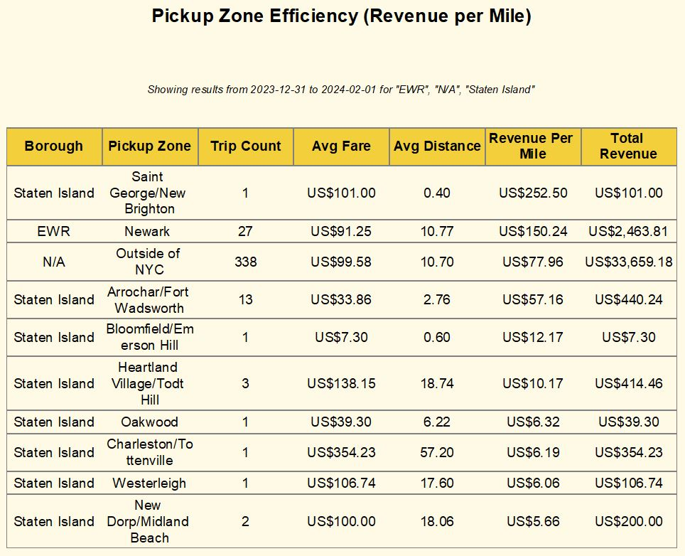{.border .shadow}

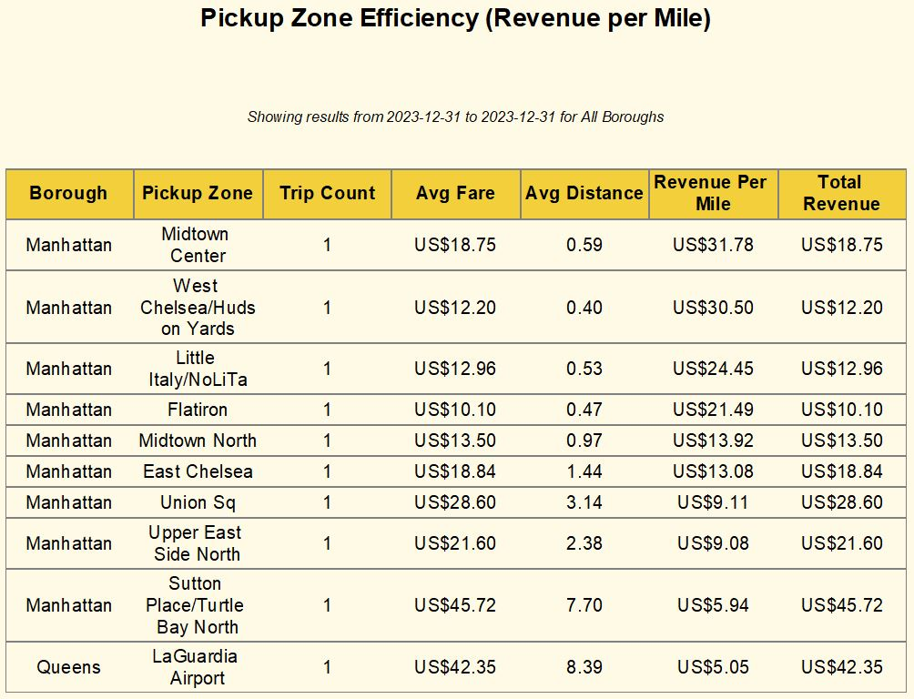{.border .shadow}

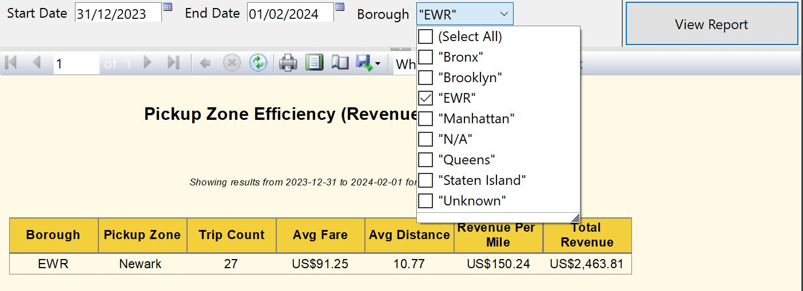{.border .shadow}
:::

### 3. Specialized Analytical Views
Beyond standard tables, I utilized different SSRS data regions (Matrix and Sub-reports) to provide diverse perspectives on the taxi operations:

::: {layout-ncol=3}
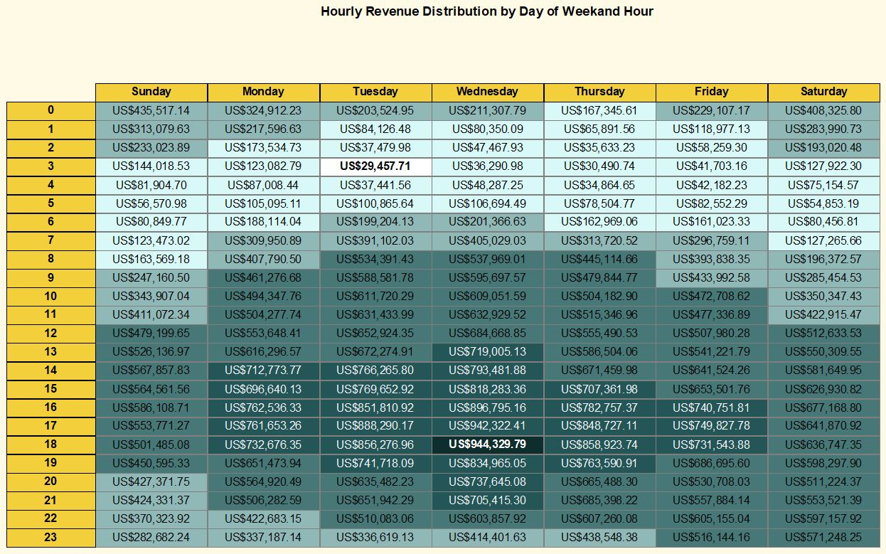{.border .shadow}

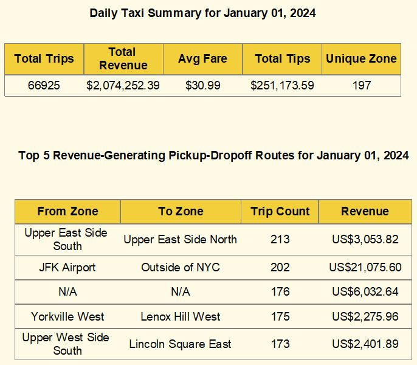{.border .shadow}

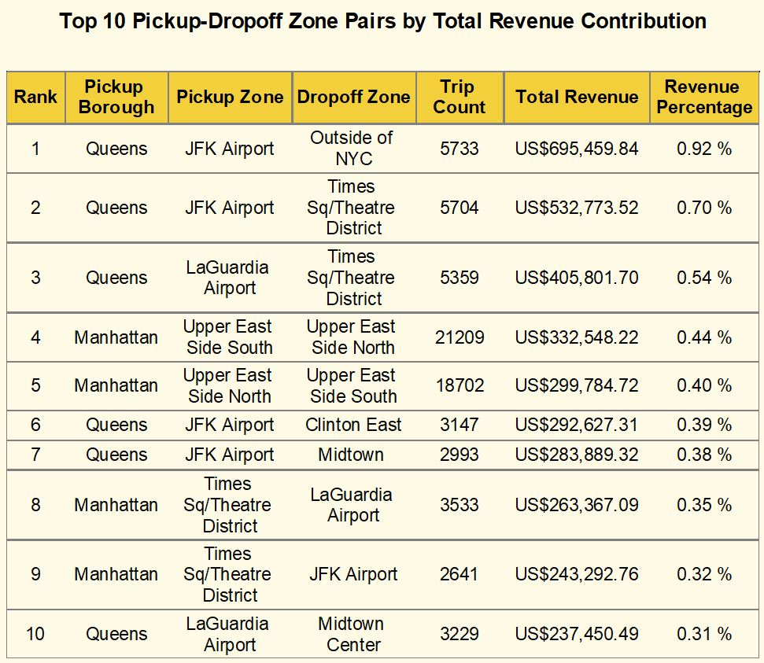{.border .shadow}
:::

---

::: {.callout-tip}
## Phase 3 Reporting Assets
The complete SSRS solution—including the report definitions (.rdl), shared data source (.rds), and the project solution (.sln)—is available in the project archive below.
:::

::: {layout-ncol=1}
[📥 Download SSRS Project Archive (.zip)](nyc_taxi_ssrs.zip){target="_blank" .btn .btn-outline-primary .rounded-pill .px-4}
:::

---


## Phase 4: Visual Analytics (Tableau)

The final phase transforms the data warehouse into a strategic asset. While SSRS provided operational detail, this Tableau dashboard reveals geographic trends and demand cycles that inform long-term recruitment strategy.

### Dashboard Preview
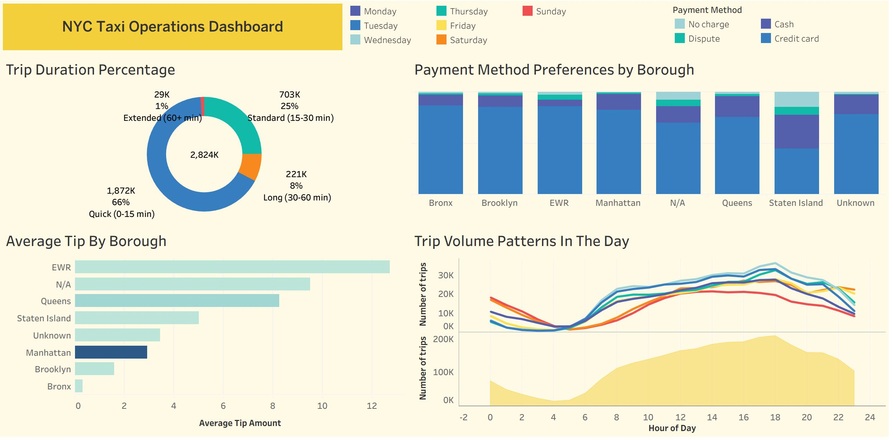{.border .shadow .rounded}

### Interactive Dashboard
Explore the NYC taxi patterns directly below. Use the interactive filters to analyze specific borough performance and vendor trends.

[<i class="bi bi-bar-chart-line"></i> View on Tableau Public](https://public.tableau.com/app/profile/anish.rao/viz/NYC_Taxi_CA1/NYCDashboard){target="_blank" .btn .btn-outline-primary .btn-sm}

::: {.column-page .border .shadow .rounded .p-3}
<div class='tableauPlaceholder' id='viz1772716550272' style='position: relative'>
  <noscript>
    <a href='#'>
      
    </a>
  </noscript>
  <object class='tableauViz' style='display:none;'>
    <param name='host_url' value='https%3A%2F%2Fpublic.tableau.com%2F' />
    <param name='embed_code_version' value='3' />
    <param name='site_root' value='' />
    <param name='name' value='NYC_Taxi_CA1/NYCDashboard' />
    <param name='tabs' value='no' />
    <param name='toolbar' value='yes' />
    <param name='static_image' value='https://public.tableau.com/static/images/NY/NYC_Taxi_CA1/NYCDashboard/1.png' />
    <param name='animate_transition' value='yes' />
    <param name='display_static_image' value='yes' />
    <param name='display_spinner' value='yes' />
    <param name='display_overlay' value='yes' />
    <param name='display_count' value='yes' />
    <param name='language' value='en-US' />
  </object>
</div>
<script type='text/javascript'>
  var divElement = document.getElementById('viz1772716550272');
  var vizElement = divElement.getElementsByTagName('object')[0];
  if (divElement.offsetWidth > 800) {
    vizElement.style.width = '100%'; vizElement.style.height = (divElement.offsetWidth * 0.75) + 'px';
  } else if (divElement.offsetWidth > 500) {
    vizElement.style.width = '100%'; vizElement.style.height = (divElement.offsetWidth * 0.75) + 'px';
  } else {
    vizElement.style.width = '100%'; vizElement.style.height = '1427px';
  }
  var scriptElement = document.createElement('script');
  scriptElement.src = 'https://public.tableau.com/javascripts/api/viz_v1.js';
  vizElement.parentNode.insertBefore(scriptElement, vizElement);
</script>
:::

### Analytical Strategy & Design
* **Geographic Heat-mapping:** Visualizing trip density to identify high-volume pickup zones, specifically highlighting airport activity.
* **Temporal Patterns:** Analyzing demand by hour and day of the week to optimize driver shift scheduling.
* **Financial Distribution:** Correlating trip distance with total fare to identify the most profitable routes.

### Key Insights
* **Peak Demand:** Data confirms a 15% spike in demand during evening rush hours in Manhattan, suggesting a critical need for driver availability.
* **Airport Dynamics:** JFK and LaGuardia represent the highest "Tip-to-Fare" ratios, making them primary recruitment targets for premium drivers.
* **Volume vs. Value:** While Brooklyn shows high trip counts, Manhattan remains the revenue leader due to shorter, more frequent turnarounds.

### Technical Skills Demonstrated
* **Tool:** Tableau.
* **Visualizations:** Dual-Axis Maps, Tree Maps, and Scatter Plots.
* **Calculations:** Used $R^{2}$ and trend lines to validate the correlation between trip duration and tip percentage.

---

::: {.callout-tip}
### Phase 4 Source Files & Full Report
For a deep dive into the methodology, business requirements, and full technical specifications, you can download the project files below.
:::

[<i class="bi bi-file-earmark-pdf"></i> View Analysis Report (PDF)](nyc_taxi_dw.pdf){target="_blank" .btn .btn-outline-primary .rounded-pill .px-4}
[ <i class="bi bi-file-earmark-code"></i> Download Tableau Workbook (.twbx)](nyc_taxi_analytics.twbx){target="_blank" .btn .btn-outline-primary .rounded-pill .px-4}